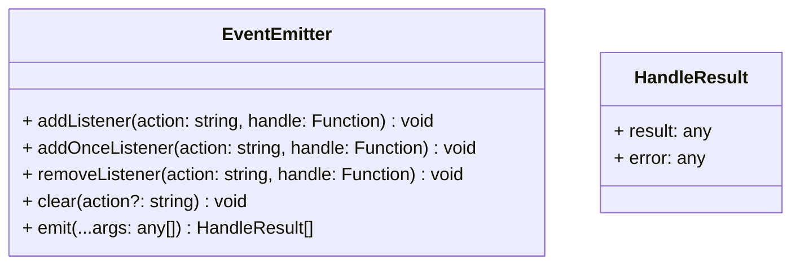

# Event

[](https://www.npmjs.com/package/@itharbors/event)
[](https://github.com/itharbors/event/actions/workflows/ci.yaml)

### 目标与范围

简单的事件发送功能，支持 TS 定义，在使用前定义好事件的类型以及监听函数的参数和返回值类型

## 需求分析

### 功能需求

- 基础的事件功能
- 支持定义事件名称和监听函数类型

### 非功能需求

- 暂无

## 整体结构

### 图例

基本结构



## 代码范例

基础用法

```typescript
import { EventEmitter } from '@itharbors/event';

const emitter = new EventEmitter<{
    test: {
        params: [number, number];
        result: number;
    };
}>();

emitter.addListener('test', (a, b) => {
    console.log(a, b);
    return a + b;
});

emitter.emit('test-a', 1, 2);
```

## 关键决策

- emit 只处理同步逻辑
    - 有可能需要处理异步，但是也有可能触发异步函数后，不需要处理，所以这里留给调用者处理

## 异常处理设计

- 某个处理函数执行失败
    - 描述
        - 执行 handle 队列的时候，某个函数报错
    - 处理
        - 记录当前报错的 error
        - 继续后续函数执行

## 性能优化

- 暂无

## 附件与参考文档

- 暂无